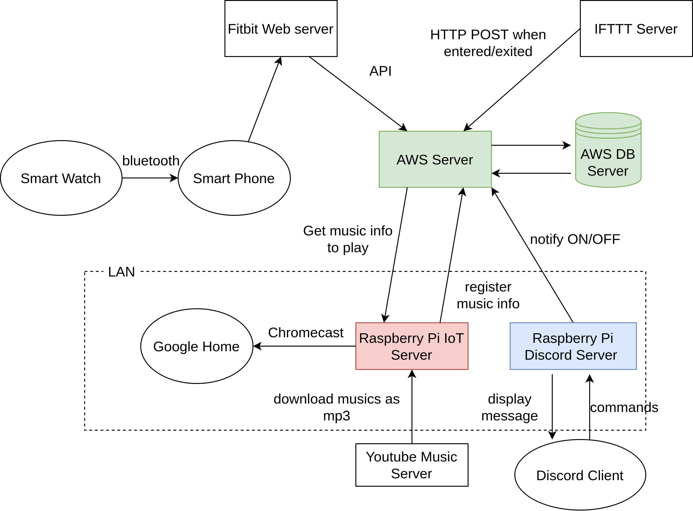

# Smart Watch IoT Client

This is an application that acquires your heart rate with a smartwatch, and recommends and plays back the appropriate BPM according to your heart rate.

The colored servers in the figure below are constructed.
The URLs of each repository are as follows.

- AWS server (https://github.com/ITK13201/smart-watch-iot-server)
- **(This repository) Raspberry Pi IoT Server** (https://github.com/ITK13201/smart-watch-iot-client)
- Raspberry Pi Discord Server (https://github.com/ITK13201/smart-watch-iot-interactive-server)



## Setup

### 1. Install

```shell
pip install pipenv
pipenv install --dev
```

### 2. Create .env file from .env.example

1. copy .env.example to .env

```shell
cp ./.env.example ./.env
```

2. edit .env


### 3. (Optional) Create json file of ytmusicapi authorization

Refer to [the official documentation of ytmusicapi](https://ytmusicapi.readthedocs.io/en/latest/setup.html) and create an authentication file (`ytm_auth_headers.json`) for it.

## Usage

### Run

```shell
# development
pipenv run dev
# or
# production (run as daemon)
pipenv run start
```

### Enter the virtual environment

```shell
pipenv shell
```

### Tracking and Format "*.py" file

```shell
pipenv run watch
```

### Format changed "*.py" file

```shell
pipenv run format
```

### Download musics from YouTube Music

```shell
pipenv run flask job download_musics --url <YouTube Music URL>
```

### register music informations to [AWS Server](https://github.com/ITK13201/smart-watch-iot-server)

```shell
pipenv run flask job register_music_informations
```

## Test Usage

### Search musics from YouTube Music

```shell
pipenv run flask job search_music_by_name --name <Music Title>
```

### Play music from music path

```shell
pipenv run flask job play_music --path <Music Path>
```
